# KDE informative selection
`pubBonneryBreidtCoquet2017` is an R package that contains the source code to reproduce the graphs and simulations of a paper to come.

## 1. How to install the package

```r
devtools::install_github("DanielBonnery/pubBonneryBreidtCoquet2017",force=TRUE)
```

Note that this package depends on different packages we developped, that will be installed automatically, including:
* [pubBonneryBreidtCoquet2016](https://github.com/DanielBonnery/pubBonneryBreidtCoquet2017). pubBonneryBreidtCoquet2016 is a package that contains generic functions to simulate populations and draw samples

## 2. Simulations

For the description of the simulations, we will provide the link to the paper once published.
### 2.1. Population/design model 1

Execution: 


```r
demo(model1,package = "pubBonneryBreidtCoquet2017")
demo(model2,package = "pubBonneryBreidtCoquet2017")
demo(model3,package = "pubBonneryBreidtCoquet2017")
demo(model4,package = "pubBonneryBreidtCoquet2017")
demo(model5,package = "pubBonneryBreidtCoquet2017")
```


```r
nrep=1000
print(pp)
```

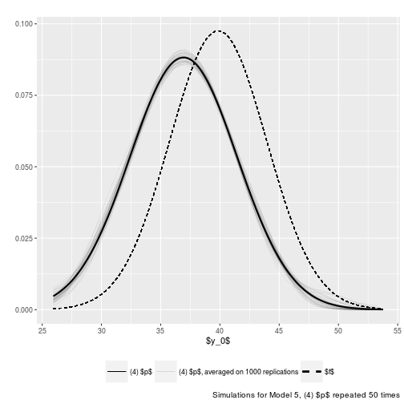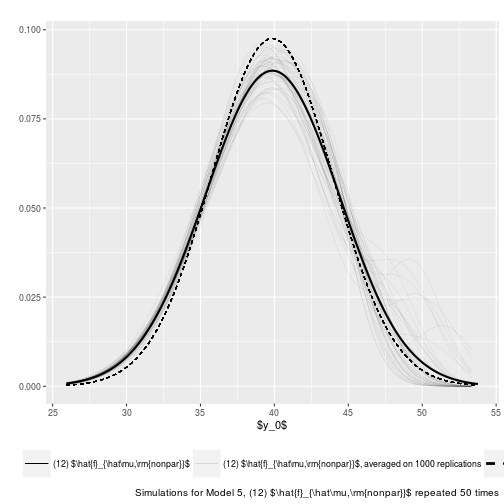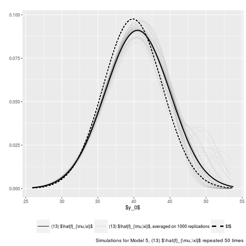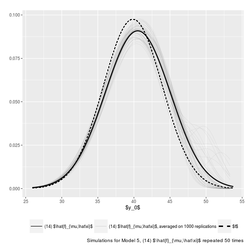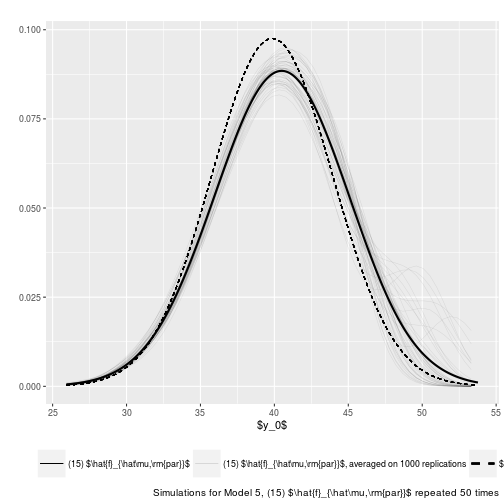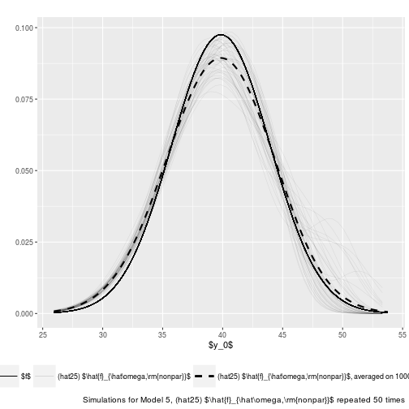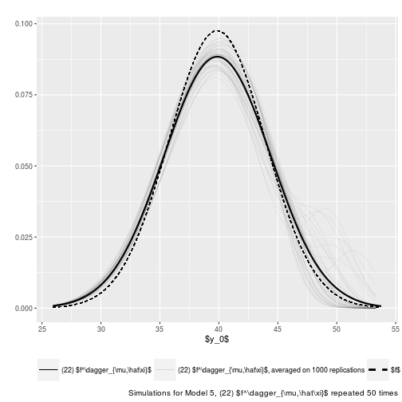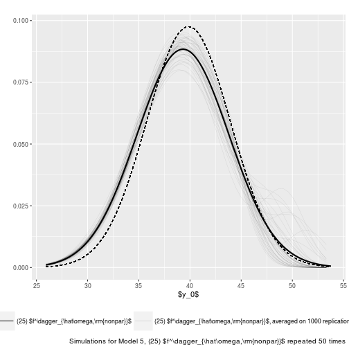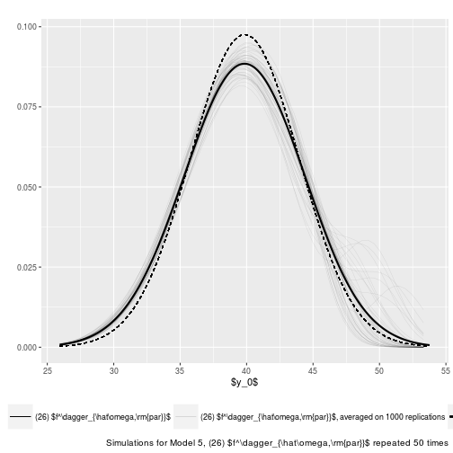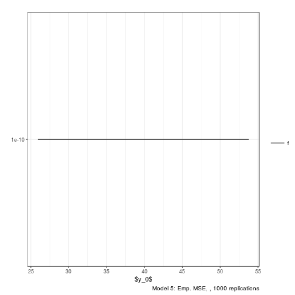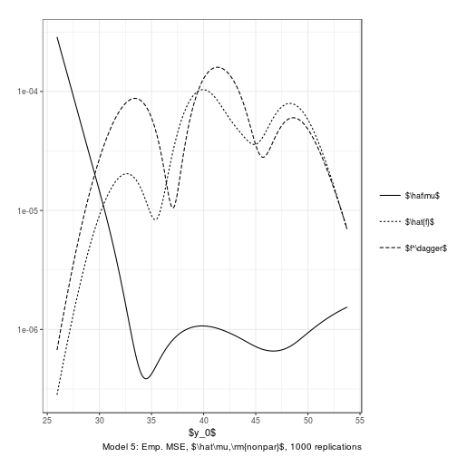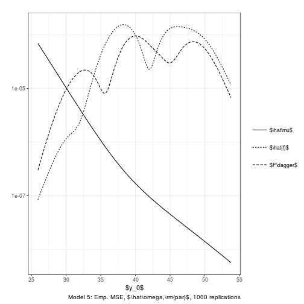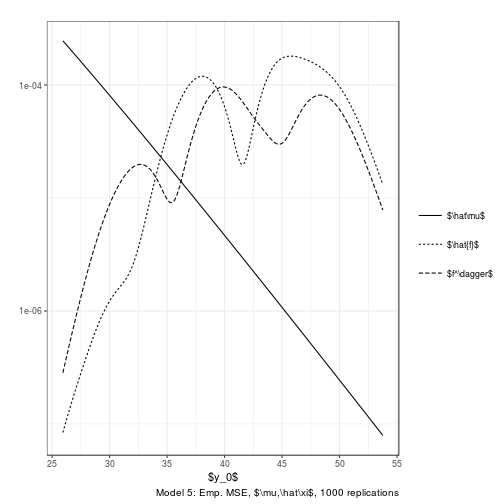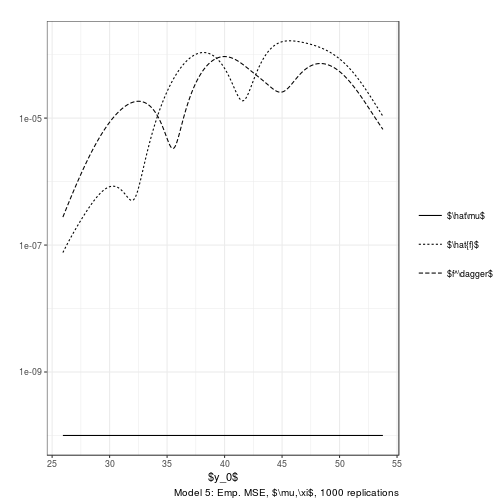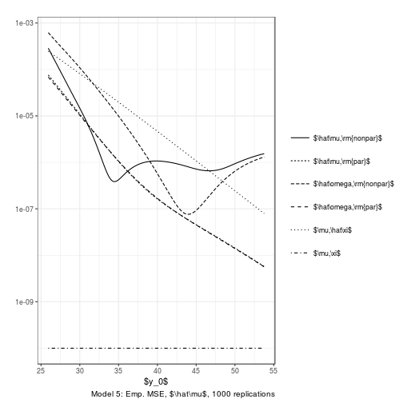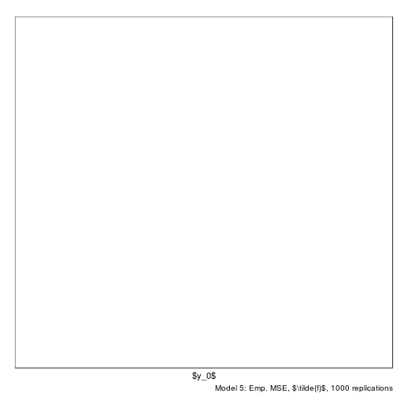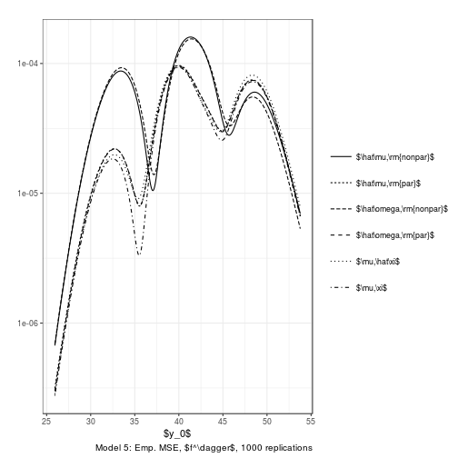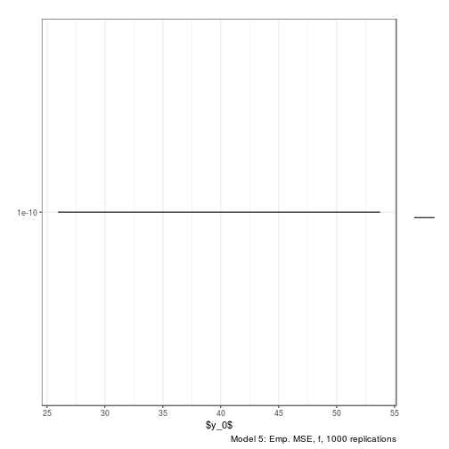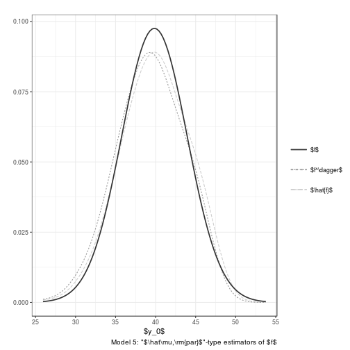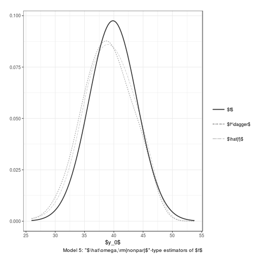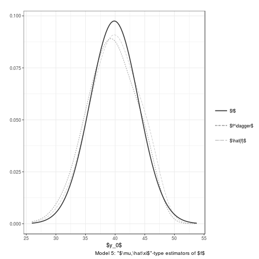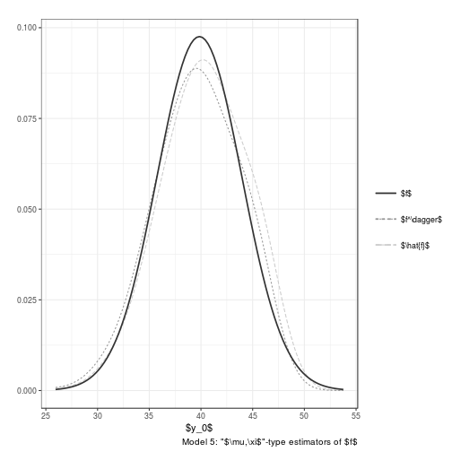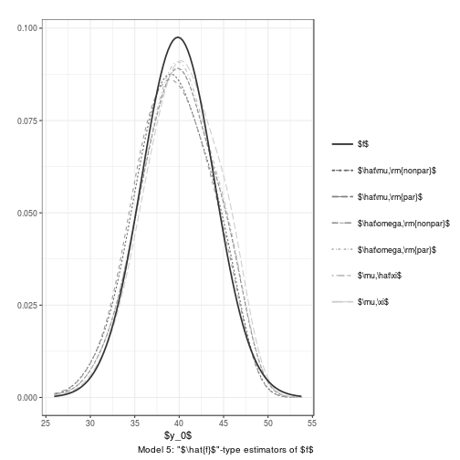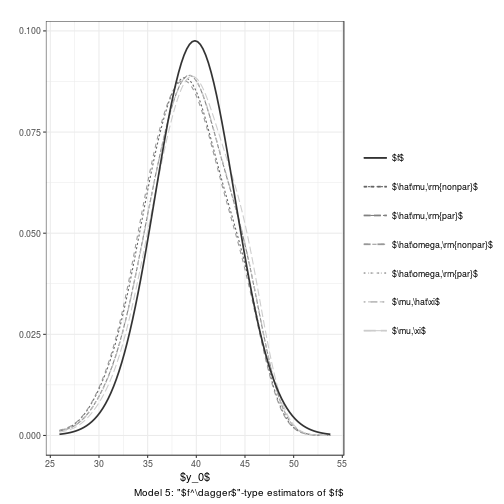

