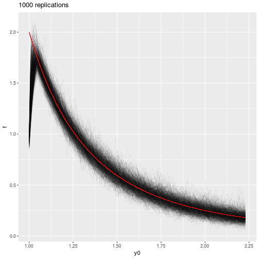

# KDE informative selection
`pubBonneryBreidtCoquet2017` is an R package that contains the source code to reproduce the graphs and simulations of a paper to come.

## 1. How to install the package

```r
devtools::install_github("DanielBonnery/pubBonneryBreidtCoquet2017",force=TRUE)
```

Note that this package depends on different packages we developped, that will be installed automatically, including:
* [pubBonneryBreidtCoquet2016](https://github.com/DanielBonnery/pubBonneryBreidtCoquet2017). pubBonneryBreidtCoquet2016 is a package that contains generic functions to simulate populations and draw samples

## 2. Simulations
### 2.1. Population/design model 1

$Y$ follows a Pareto(4) distribution.
$Z_k\mid Y_k$ follows a Bernoulli ($Y_k^{-1}$) distribution.
$I_k\mid Z_k=0$ (resp. $I_k\mid Z_k=1$)follows a Bernoulli (0.01) (resp. Bernoulli(0.1)) distribution.

#### 2.2.1 Working graph 1

We generate one population, one sample.
We estimate in all 1/1000 quantiles of Pareto(4) distribution the HT kde and the associated variance.
Band upper and lower bounds are based on a normality assumption.
Black line is Pareto(4) pdf.

Execution: 


```r
load(file.path(Mydirectories::Dropbox.directory(),"Travail/Recherche/Travaux/Estimation non paramétrique de la densité/pubBonneryBreidtCoquet2017/datanotpushed/w_graph1.rda"));
load(file.path(Mydirectories::Dropbox.directory(),"Travail/Recherche/Travaux/Estimation non paramétrique de la densité/pubBonneryBreidtCoquet2017/datanotpushed/w_graph2.rda"));
```


```r
demo(w_graph1,package = "pubBonneryBreidtCoquet2017")
```


```r
print(w_graph1)
```


#### 2.2.2 Working graph 2

Same thing, we generate 1000 simulations.

```r
demo(w_graph2,package = "pubBonneryBreidtCoquet2017")
```


```r
print(w_graph2)
```




```r
print(w_graph2.1)
```
