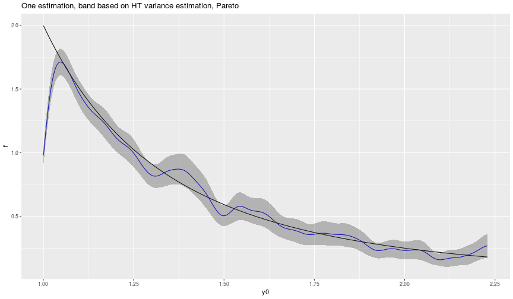

# KDE informative selection
`pubBonneryBreidtCoquet2017` is an R package that contains the source code to reproduce the graphs and simulations of a paper to come.

## 1. How to install the package

```r
devtools::install_github("DanielBonnery/pubBonneryBreidtCoquet2017",force=TRUE)
```

Note that this package depends on different packages we developped, that will be installed automatically, including:
* [pubBonneryBreidtCoquet2016](https://github.com/DanielBonnery/pubBonneryBreidtCoquet2017). pubBonneryBreidtCoquet2016 is a package that contains generic functions to simulate populations and draw samples

## 2. 
### 2.1. Graph 1 

### 2.2. Execution


```
FALSE 
FALSE 
FALSE 	demo(w_graph1)
FALSE 	---- ~~~~~~~~
FALSE 
FALSE > set.seed(1)#NB: the seed was not set for the table in the publication
FALSE 
FALSE > popmodelfunction = model.Pareto.bernstrat
FALSE 
FALSE > theta=2;
FALSE 
FALSE > xi=1;
FALSE 
FALSE > conditionalto=list(N=100000,sampleparam=list(tauh=c(0.01,0.1)))
FALSE 
FALSE > model<-popmodelfunction(theta,xi,conditionalto)
FALSE 
FALSE > Obs<-generate.observations(model)
FALSE 
FALSE > y0<-1/((1-seq(0,1,length.out=1000))^(1/theta))[-c(1,800:1000)];
FALSE 
FALSE > f<-fHT(y0,Obs)
FALSE 
FALSE > vf<-varfHT(y0,Obs)
FALSE 
FALSE > library(ggplot2)
FALSE 
FALSE > w_graph1<-
FALSE +   ggplot(data.frame(y0=y0,f=f,lb=f-qnorm(.975)*sqrt(vf),ub=f+qnorm(.975)*sqrt(vf)),aes(x=y0,y=f))+
FALSE +   geom_line(color="blue")+
FALSE +   stat_function(fun = function(y){(y>1)*theta/((y+(y==1))^(theta+1))})+
FALSE +   geom_ribbon(aes(ymin=lb, ymax=ub, x=y0), alpha = 0.3)+ 
FALSE +   ggtitle("One estimation, band based on HT variance estimation, Pareto")
```

```r
print(w_graph1)
```


