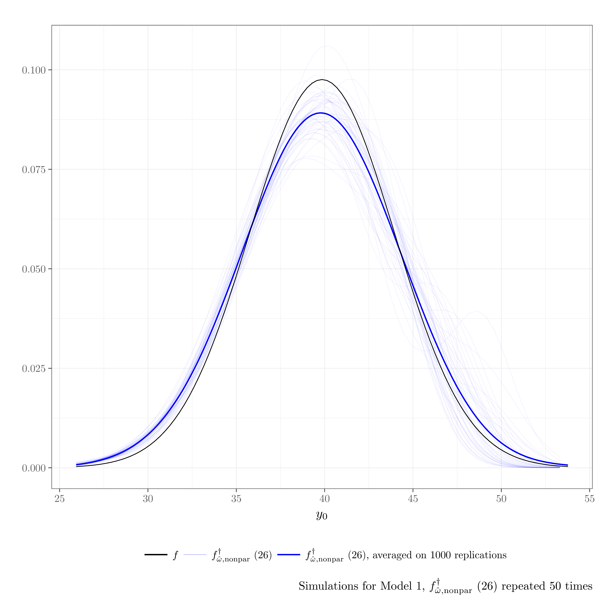
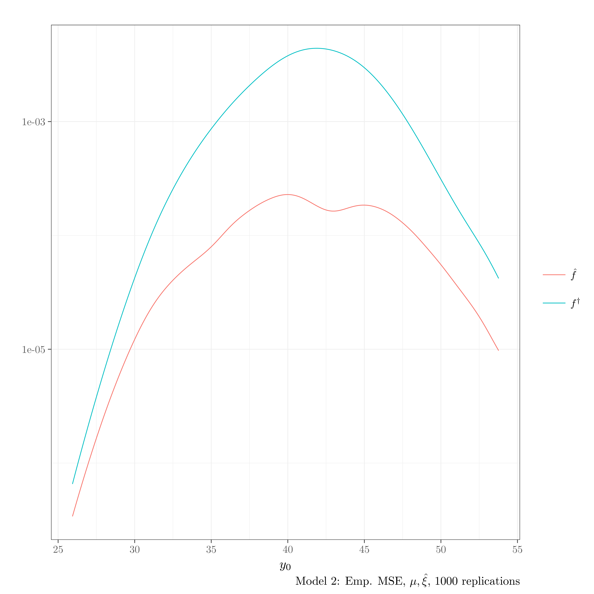
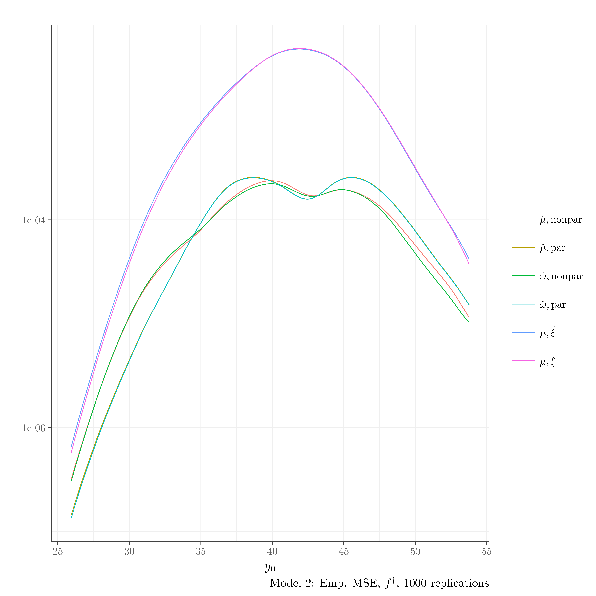
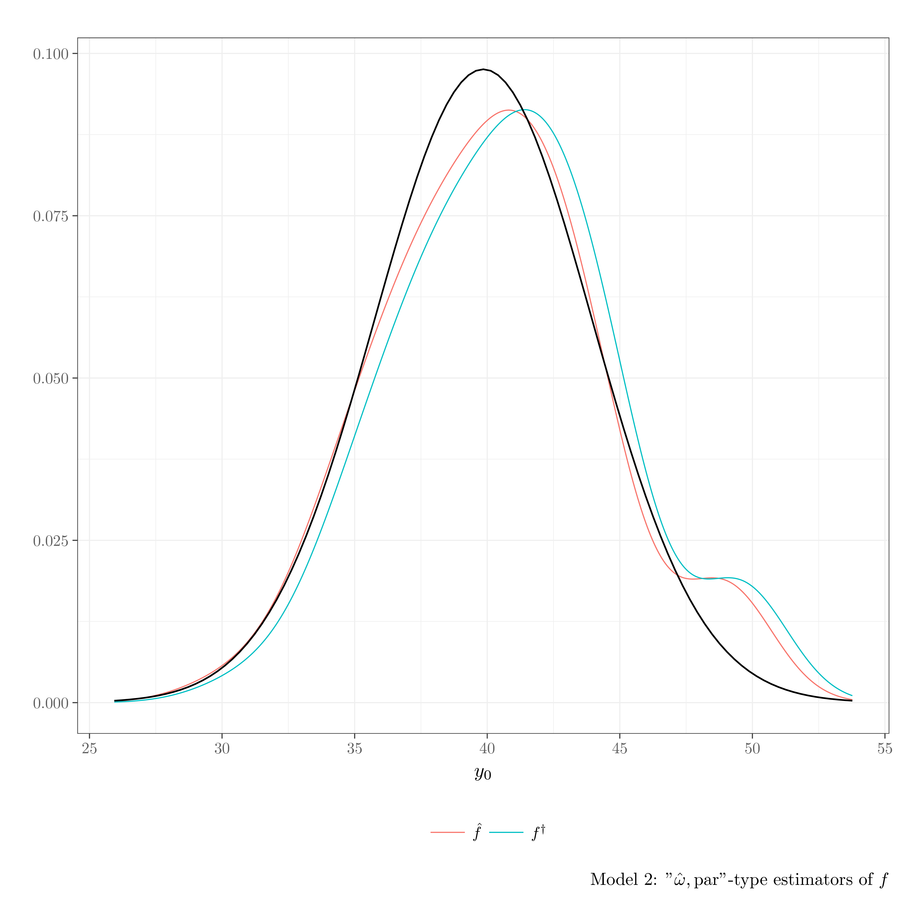
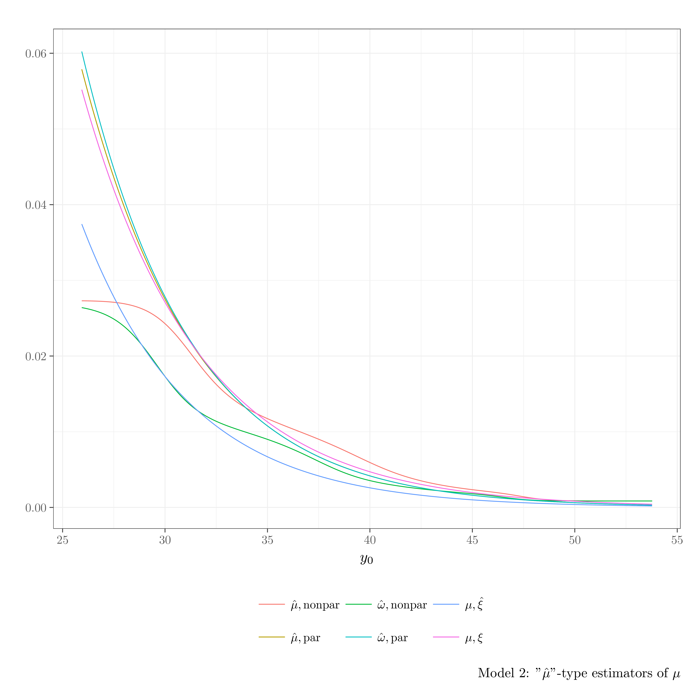
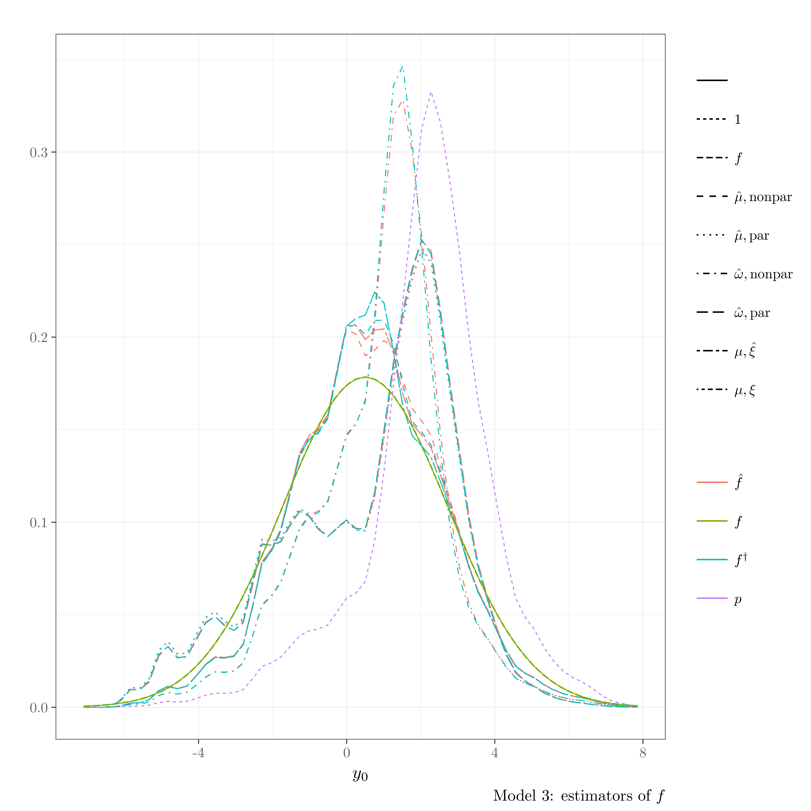
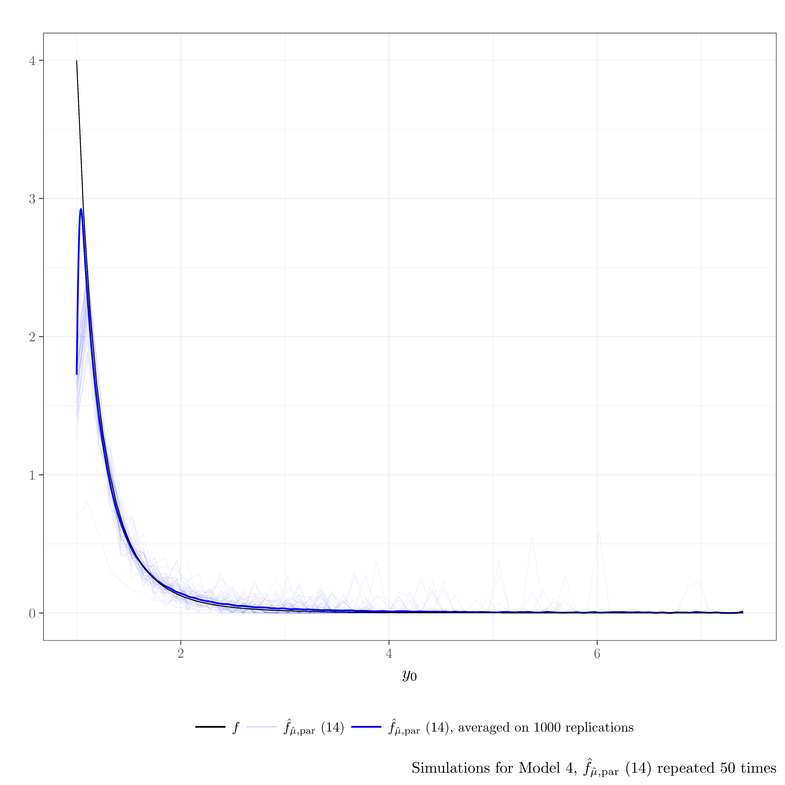
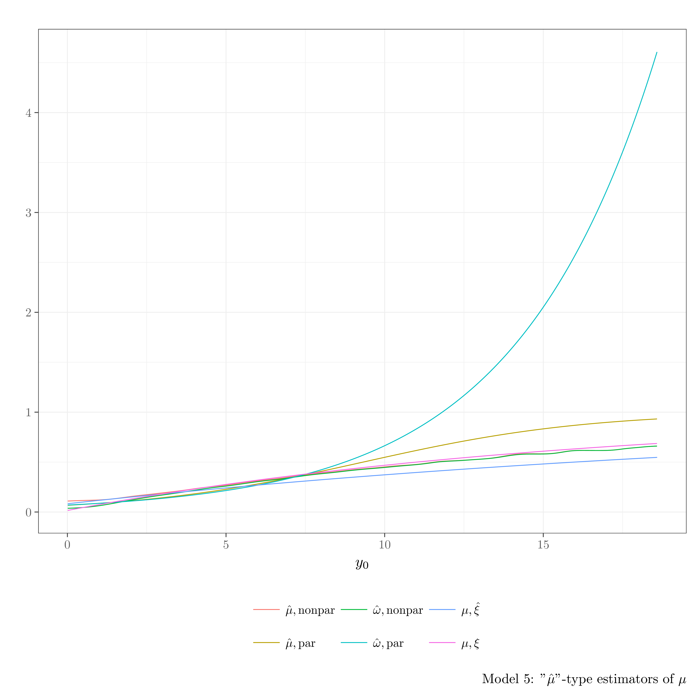

# Kernel Estimation for a Superpopulation Probability Density Function under Informative Selection
`BonneryBreidtCoquetMetronKDE` is an R package that contains the source code to reproduce the graphs and simulations of the article
"Kernel Estimation for a Superpopulation Probability Density Function under Informative Selection", by 
Daniel Bonnéry (UMD),  F. Jay Breidt (CSU) and  François Coquet (Irmar and Ensai), article under revision in Metron Journal.

## 1. Install the package
You will need to have Rtools installed, as well as the devtools package.


```r
devtools::install_github("DanielBonnery/BonneryBreidtCoquetMetronKDE",dependencies=TRUE)
```

Note that this package depends on different R packages, including:
* [pubBonneryBreidtCoquet2016](https://github.com/DanielBonnery/pubBonneryBreidtCoquet2016) is an R package that contains generic functions to simulate populations and draw samples.
* [yihui/tikzDevice](https://github.com/yihui/tikzDevice) is an R package that allows to create tikz code from a graph.

Some functions of `BonneryBreidtCoquetMetronKDE` produce pdf graphics and need pdflatex to be installed.

## 2. Produce the paper graphs and tables.


```r
library(BonneryBreidtCoquetMetronKDE)
demo(MSE_Figure)
```


|Estimator                                    |IMSE           |IMSE $\mid Y<q_{.25}$ |IMSE $\mid q_{.25}<Y<q_{.5}$ |IMSE $\mid q_{.5}<Y<q_{.75}$ |IMSE $\mid q_{.75}<Y$ |
|:--------------------------------------------|:--------------|:---------------------|:----------------------------|:----------------------------|:---------------------|
|$f$                                          |0 (0)          |0 (0)                 |0 (0)                        |0 (0)                        |0 (0)                 |
|(15) $\hat{f}_{\hat\mu,\rm{par}}$            |0.0017 (1.6)   |0.00023 (1.9)         |4e-04 (1.9)                  |0.00014 (0.59)               |0.00098 (1.9)         |
|(12) $\hat{f}_{\hat\mu,\rm{nonpar}}$         |0.0011 (1)     |0.00012 (1)           |2e-04 (1)                    |0.00023 (1)                  |0.00052 (1)           |
|(13) $\hat{f}_{\mu,\xi}$                     |0.0016 (1.5)   |0.00015 (1.2)         |0.00027 (1.3)                |9.1e-05 (0.39)               |0.0011 (2.1)          |
|(14) $\hat{f}_{\mu,\hat\xi}$                 |0.0018 (1.7)   |0.00019 (1.6)         |0.00029 (1.4)                |9.7e-05 (0.42)               |0.0012 (2.3)          |
|(4) $p$                                      |0.015 (14)     |0.0072 (59)           |0.00052 (2.6)                |0.0033 (14)                  |0.0037 (7.1)          |
|(23) $f^\dagger_{\hat\mu,\rm{par}}$          |0.001 (0.94)   |0.00013 (1)           |0.00019 (0.91)               |0.00022 (0.95)               |0.00048 (0.93)        |
|(20) $f^\dagger_{\hat\mu,\rm{nonpar}}$       |0.0015 (1.4)   |0.00043 (3.5)         |0.00015 (0.73)               |0.00041 (1.8)                |0.00051 (0.99)        |
|(21) $f^\dagger_{\mu,\xi}$                   |0.00094 (0.87) |9.8e-05 (0.81)        |0.00018 (0.86)               |0.00021 (0.9)                |0.00045 (0.87)        |
|(22) $f^\dagger_{\mu,\hat\xi}$               |0.001 (0.96)   |0.00012 (0.99)        |0.00019 (0.94)               |0.00021 (0.91)               |0.00051 (0.98)        |
|(25) $f^\dagger_{\hat\omega,\rm{nonpar}}$    |0.0015 (1.4)   |0.00046 (3.8)         |0.00014 (0.69)               |4e-04 (1.7)                  |5e-04 (0.97)          |
|(26) $f^\dagger_{\hat\omega,\rm{par}}$       |0.001 (0.93)   |0.00012 (1)           |0.00018 (0.89)               |0.00022 (0.94)               |0.00048 (0.92)        |
|(wnonpar) $\hat{f}_{\hat\omega,\rm{nonpar}}$ |0.001 (0.96)   |0.00014 (1.2)         |0.00019 (0.94)               |0.00022 (0.97)               |0.00048 (0.92)        |
|(wpar) $\hat{f}_{\hat\omega,\rm{par}}$       |0.0017 (1.6)   |0.00023 (1.9)         |0.00039 (1.9)                |0.00013 (0.57)               |0.00097 (1.9)         |
|$\hat\mu,\rm{par}                            |0.00016 (0.15) |0.00016 (1.3)         |7.7e-07 (0.0038)             |3.3e-07 (0.0014)             |3.2e-07 (0.00061)     |
|$\hat\mu,\rm{nonpar}                         |0.00041 (0.38) |0.00039 (3.2)         |2.7e-06 (0.013)              |2.8e-06 (0.012)              |1e-05 (0.02)          |
|$\mu,\hat\xi                                 |0.00089 (0.83) |0.00086 (7)           |2.1e-05 (0.1)                |9.2e-06 (0.04)               |7.1e-06 (0.014)       |
|$\mu,\xi                                     |0 (0)          |0 (0)                 |0 (0)                        |0 (0)                        |0 (0)                 |
|$\hat\omega,\rm{nonpar}                      |0.0014 (1.3)   |0.0014 (12)           |4.5e-06 (0.022)              |8.1e-07 (0.0035)             |5.4e-06 (0.01)        |
|$\hat\omega,\rm{par}                         |0.00015 (0.14) |0.00015 (1.2)         |8e-07 (0.0039)               |3.3e-07 (0.0014)             |3.1e-07 (6e-04)       |

## 3. Run additional simulations

We ran simulations on different models. For each model, we produce a series of graphics and tables.


The following R statements  will run the simulations for all the models.


```r
library(BonneryBreidtCoquetMetronKDE)
demo(model1,package = "BonneryBreidtCoquetMetronKDE")
demo(model2,package = "BonneryBreidtCoquetMetronKDE")
demo(model3,package = "BonneryBreidtCoquetMetronKDE")
demo(model4,package = "BonneryBreidtCoquetMetronKDE")
demo(model5,package = "BonneryBreidtCoquetMetronKDE")
```


### Model  6 




### Model  model1_col-figure9.png 














### Model  model2_col-figure9.png 



### Model  model3_col-figure9.png 





### Model  model4_col-figure9.png 





## 2.2.3 Ouptputs: Tables

### Model 1:


|Estimator                                    |IMSE           |IMSE $\mid Y<q_{.25}$ |IMSE $\mid q_{.25}<Y<q_{.5}$ |IMSE $\mid q_{.5}<Y<q_{.75}$ |IMSE $\mid q_{.75}<Y$ |
|:--------------------------------------------|:--------------|:---------------------|:----------------------------|:----------------------------|:---------------------|
|$f$                                          |0 (0)          |0 (0)                 |0 (0)                        |0 (0)                        |0 (0)                 |
|(15) $\hat{f}_{\hat\mu,\rm{par}}$            |0.094 (1.1)    |0.068 (1.1)           |0.0047 (0.87)                |0.0038 (0.46)                |0.018 (1.3)           |
|(12) $\hat{f}_{\hat\mu,\rm{nonpar}}$         |0.086 (1)      |0.059 (1)             |0.0054 (1)                   |0.0081 (1)                   |0.014 (1)             |
|(13) $\hat{f}_{\mu,\xi}$                     |0.068 (0.78)   |0.054 (0.91)          |0.0043 (0.8)                 |0.0042 (0.51)                |0.0054 (0.39)         |
|(14) $\hat{f}_{\mu,\hat\xi}$                 |0.069 (0.79)   |0.054 (0.92)          |0.0047 (0.87)                |0.0042 (0.51)                |0.0054 (0.4)          |
|(4) $p$                                      |0.06 (0.69)    |0.04 (0.67)           |0.011 (2)                    |0.0038 (0.46)                |0.0055 (0.4)          |
|(23) $f^\dagger_{\hat\mu,\rm{par}}$          |0.1 (1.2)      |0.075 (1.3)           |0.0063 (1.2)                 |0.0046 (0.56)                |0.017 (1.2)           |
|(20) $f^\dagger_{\hat\mu,\rm{nonpar}}$       |0.081 (0.93)   |0.058 (0.98)          |0.0046 (0.85)                |0.0066 (0.81)                |0.012 (0.84)          |
|(21) $f^\dagger_{\mu,\xi}$                   |0.07 (0.8)     |0.058 (0.99)          |0.0029 (0.53)                |0.0034 (0.41)                |0.0049 (0.35)         |
|(22) $f^\dagger_{\mu,\hat\xi}$               |0.07 (0.81)    |0.059 (0.99)          |0.0032 (0.59)                |0.0034 (0.41)                |0.005 (0.36)          |
|(25) $f^\dagger_{\hat\omega,\rm{nonpar}}$    |0.32 (3.6)     |0.19 (3.2)            |0.034 (6.2)                  |0.049 (6)                    |0.043 (3.1)           |
|(26) $f^\dagger_{\hat\omega,\rm{par}}$       |0.1 (1.2)      |0.076 (1.3)           |0.0062 (1.2)                 |0.0044 (0.55)                |0.016 (1.1)           |
|(wnonpar) $\hat{f}_{\hat\omega,\rm{nonpar}}$ |0.36 (4.2)     |0.2 (3.4)             |0.037 (6.9)                  |0.055 (6.8)                  |0.068 (4.9)           |
|(wpar) $\hat{f}_{\hat\omega,\rm{par}}$       |0.094 (1.1)    |0.069 (1.2)           |0.0046 (0.86)                |0.0037 (0.46)                |0.017 (1.2)           |
|$\hat\mu,\rm{par}                            |0.003 (0.035)  |2.1e-05 (0.00036)     |2.6e-05 (0.0048)             |4.2e-05 (0.0052)             |0.0029 (0.21)         |
|$\hat\mu,\rm{nonpar}                         |0.02 (0.23)    |7.9e-07 (1.3e-05)     |1e-05 (0.0019)               |7.7e-05 (0.0095)             |0.02 (1.4)            |
|$\mu,\hat\xi                                 |2e-04 (0.0023) |3.1e-08 (5.2e-07)     |3.8e-07 (7.1e-05)            |2.5e-06 (0.00031)            |0.00019 (0.014)       |
|$\mu,\xi                                     |0 (0)          |0 (0)                 |0 (0)                        |0 (0)                        |0 (0)                 |
|$\hat\omega,\rm{nonpar}                      |0.02 (0.24)    |4.5e-05 (0.00076)     |0.00016 (0.03)               |0.00041 (0.05)               |0.02 (1.4)            |
|$\hat\omega,\rm{par}                         |0.003 (0.035)  |2.4e-05 (4e-04)       |3e-05 (0.0055)               |5e-05 (0.0061)               |0.0029 (0.21)         |
### Model 2:

|Estimator                                    |IMSE           |IMSE $\mid Y<q_{.25}$ |IMSE $\mid q_{.25}<Y<q_{.5}$ |IMSE $\mid q_{.5}<Y<q_{.75}$ |IMSE $\mid q_{.75}<Y$ |
|:--------------------------------------------|:--------------|:---------------------|:----------------------------|:----------------------------|:---------------------|
|$f$                                          |0 (0)          |0 (0)                 |0 (0)                        |0 (0)                        |0 (0)                 |
|(15) $\hat{f}_{\hat\mu,\rm{par}}$            |0.0065 (2.8)   |0.0045 (2.4)          |0.00037 (1.6)                |0.0012 (17)                  |0.00036 (2.4)         |
|(12) $\hat{f}_{\hat\mu,\rm{nonpar}}$         |0.0023 (1)     |0.0019 (1)            |0.00023 (1)                  |7.4e-05 (1)                  |0.00015 (1)           |
|(13) $\hat{f}_{\mu,\xi}$                     |0.0033 (1.4)   |0.0029 (1.5)          |0.00022 (0.93)               |0.00013 (1.8)                |5.7e-05 (0.38)        |
|(14) $\hat{f}_{\mu,\hat\xi}$                 |0.0097 (4.1)   |0.0069 (3.7)          |0.00084 (3.6)                |0.00053 (7.2)                |0.0014 (9.5)          |
|(4) $p$                                      |0.041 (17)     |0.024 (13)            |0.0081 (35)                  |0.00078 (11)                 |0.0075 (50)           |
|(23) $f^\dagger_{\hat\mu,\rm{par}}$          |0.0078 (3.3)   |0.006 (3.2)           |0.00035 (1.5)                |0.0011 (15)                  |0.00034 (2.3)         |
|(20) $f^\dagger_{\hat\mu,\rm{nonpar}}$       |0.0037 (1.6)   |0.0032 (1.7)          |0.00016 (0.68)               |0.00011 (1.5)                |0.00022 (1.5)         |
|(21) $f^\dagger_{\mu,\xi}$                   |0.00088 (0.37) |0.00048 (0.25)        |0.00021 (0.9)                |0.00013 (1.8)                |5.6e-05 (0.37)        |
|(22) $f^\dagger_{\mu,\hat\xi}$               |0.012 (5)      |0.0088 (4.7)          |0.0011 (4.6)                 |0.00045 (6.1)                |0.0013 (8.7)          |
|(25) $f^\dagger_{\hat\omega,\rm{nonpar}}$    |0.0015 (0.64)  |0.00084 (0.45)        |0.00021 (0.91)               |0.00034 (4.6)                |0.00011 (0.74)        |
|(26) $f^\dagger_{\hat\omega,\rm{par}}$       |0.0091 (3.9)   |0.0065 (3.5)          |0.00042 (1.8)                |0.0016 (21)                  |0.00053 (3.5)         |
|(wnonpar) $\hat{f}_{\hat\omega,\rm{nonpar}}$ |0.0046 (2)     |0.0039 (2.1)          |3e-04 (1.3)                  |0.00034 (4.6)                |1e-04 (0.7)           |
|(wpar) $\hat{f}_{\hat\omega,\rm{par}}$       |0.0079 (3.4)   |0.0051 (2.7)          |0.00045 (1.9)                |0.0017 (24)                  |0.00054 (3.6)         |
|$\hat\mu,\rm{par}                            |0.14 (58)      |0.00083 (0.44)        |0.00036 (1.5)                |0.0031 (42)                  |0.13 (870)            |
|$\hat\mu,\rm{nonpar}                         |0.008 (3.4)    |0.0046 (2.4)          |0.00082 (3.5)                |0.00018 (2.5)                |0.0023 (16)           |
|$\mu,\hat\xi                                 |0.061 (26)     |0.0027 (1.4)          |0.00063 (2.7)                |0.00015 (2.1)                |0.057 (380)           |
|$\mu,\xi                                     |0 (0)          |0 (0)                 |0 (0)                        |0 (0)                        |0 (0)                 |
|$\hat\omega,\rm{nonpar}                      |0.0046 (2)     |0.00016 (0.088)       |0.00017 (0.74)               |0.00027 (3.7)                |0.004 (27)            |
|$\hat\omega,\rm{par}                         |2.2 (920)      |0.00091 (0.48)        |0.00048 (2)                  |0.0044 (59)                  |2.2 (14000)           |
### Model 3:

|Estimator                                    |IMSE              |IMSE $\mid Y<q_{.25}$ |IMSE $\mid q_{.25}<Y<q_{.5}$ |IMSE $\mid q_{.5}<Y<q_{.75}$ |IMSE $\mid q_{.75}<Y$ |
|:--------------------------------------------|:-----------------|:---------------------|:----------------------------|:----------------------------|:---------------------|
|$f$                                          |0 (0)             |0 (0)                 |0 (0)                        |0 (0)                        |0 (0)                 |
|(15) $\hat{f}_{\hat\mu,\rm{par}}$            |0.022 (10)        |0.0016 (2.9)          |0.0073 (9.9)                 |0.0068 (10)                  |0.0068 (31)           |
|(12) $\hat{f}_{\hat\mu,\rm{nonpar}}$         |0.0021 (1)        |0.00053 (1)           |0.00074 (1)                  |0.00065 (1)                  |0.00022 (1)           |
|(13) $\hat{f}_{\mu,\xi}$                     |0.0026 (1.2)      |0.00053 (1)           |0.00079 (1.1)                |0.001 (1.6)                  |0.00023 (1)           |
|(14) $\hat{f}_{\mu,\hat\xi}$                 |0.0026 (1.2)      |0.00053 (1)           |0.00079 (1.1)                |0.001 (1.6)                  |0.00023 (1)           |
|(4) $p$                                      |0.089 (42)        |0.011 (21)            |0.019 (26)                   |0.014 (21)                   |0.045 (200)           |
|(23) $f^\dagger_{\hat\mu,\rm{par}}$          |0.023 (11)        |0.0015 (2.9)          |0.0073 (9.8)                 |0.0068 (10)                  |0.0072 (32)           |
|(20) $f^\dagger_{\hat\mu,\rm{nonpar}}$       |0.0019 (0.89)     |0.00053 (1)           |0.00069 (0.93)               |0.00046 (0.7)                |0.00024 (1.1)         |
|(21) $f^\dagger_{\mu,\xi}$                   |0.002 (0.94)      |0.00052 (0.99)        |0.00072 (0.98)               |0.00055 (0.84)               |0.00021 (0.97)        |
|(22) $f^\dagger_{\mu,\hat\xi}$               |0.002 (0.94)      |0.00052 (0.99)        |0.00072 (0.98)               |0.00055 (0.84)               |0.00021 (0.97)        |
|(25) $f^\dagger_{\hat\omega,\rm{nonpar}}$    |0.031 (14)        |0.0022 (4.1)          |0.0017 (2.3)                 |0.024 (36)                   |0.0034 (15)           |
|(26) $f^\dagger_{\hat\omega,\rm{par}}$       |0.024 (11)        |0.0013 (2.5)          |0.0072 (9.8)                 |0.0072 (11)                  |0.0079 (36)           |
|(wnonpar) $\hat{f}_{\hat\omega,\rm{nonpar}}$ |0.035 (16)        |0.0022 (4.2)          |0.0018 (2.4)                 |0.028 (42)                   |0.003 (13)            |
|(wpar) $\hat{f}_{\hat\omega,\rm{par}}$       |0.023 (11)        |0.0014 (2.6)          |0.0072 (9.8)                 |0.0072 (11)                  |0.0075 (34)           |
|$\hat\mu,\rm{par}                            |0.068 (32)        |0.00052 (0.98)        |9.4e-05 (0.13)               |0.0011 (1.7)                 |0.066 (300)           |
|$\hat\mu,\rm{nonpar}                         |0.0035 (1.6)      |2.9e-12 (5.6e-09)     |6e-05 (0.081)                |0.0034 (5.2)                 |6e-05 (0.27)          |
|$\mu,\hat\xi                                 |3.5e-08 (1.6e-05) |2.3e-19 (4.4e-16)     |3.8e-10 (5.1e-07)            |2e-08 (3.1e-05)              |1.4e-08 (6.4e-05)     |
|$\mu,\xi                                     |0 (0)             |0 (0)                 |0 (0)                        |0 (0)                        |0 (0)                 |
|$\hat\omega,\rm{nonpar}                      |0.0037 (1.7)      |3.9e-16 (7.3e-13)     |2e-07 (0.00027)              |0.002 (3.1)                  |0.0017 (7.6)          |
|$\hat\omega,\rm{par}                         |0.12 (54)         |5e-04 (0.94)          |8.5e-05 (0.12)               |0.0012 (1.8)                 |0.11 (520)            |
### Model 4:


|Estimator                                    |IMSE              |IMSE $\mid Y<q_{.25}$ |IMSE $\mid q_{.25}<Y<q_{.5}$ |IMSE $\mid q_{.5}<Y<q_{.75}$ |IMSE $\mid q_{.75}<Y$ |
|:--------------------------------------------|:-----------------|:---------------------|:----------------------------|:----------------------------|:---------------------|
|$f$                                          |0 (0)             |0 (0)                 |0 (0)                        |0 (0)                        |0 (0)                 |
|(15) $\hat{f}_{\hat\mu,\rm{par}}$            |0.0032 (1.2)      |0.00049 (1.1)         |0.00068 (1.2)                |0.00053 (0.91)               |0.0016 (1.3)          |
|(12) $\hat{f}_{\hat\mu,\rm{nonpar}}$         |0.0028 (1)        |0.00046 (1)           |0.00057 (1)                  |0.00058 (1)                  |0.0012 (1)            |
|(13) $\hat{f}_{\mu,\xi}$                     |8.5e+45 (3e+48)   |9.4e+44 (2e+48)       |2.6e+45 (4.6e+48)            |2.9e+45 (5e+48)              |2.1e+45 (1.7e+48)     |
|(14) $\hat{f}_{\mu,\hat\xi}$                 |3.1e+46 (1.1e+49) |2.7e+45 (5.8e+48)     |8.8e+45 (1.5e+49)            |1.1e+46 (1.8e+49)            |8.9e+45 (7.4e+48)     |
|(4) $p$                                      |0.016 (5.8)       |0.008 (17)            |0.00077 (1.4)                |0.0035 (6.2)                 |0.004 (3.3)           |
|(23) $f^\dagger_{\hat\mu,\rm{par}}$          |0.0027 (0.96)     |0.00046 (1)           |0.00054 (0.95)               |0.00056 (0.97)               |0.0012 (0.95)         |
|(20) $f^\dagger_{\hat\mu,\rm{nonpar}}$       |0.003 (1.1)       |0.00068 (1.5)         |0.00052 (0.92)               |0.00067 (1.2)                |0.0011 (0.95)         |
|(21) $f^\dagger_{\mu,\xi}$                   |0.0026 (0.94)     |0.00043 (0.93)        |0.00054 (0.94)               |0.00055 (0.95)               |0.0011 (0.94)         |
|(22) $f^\dagger_{\mu,\hat\xi}$               |0.0027 (0.96)     |0.00046 (1)           |0.00054 (0.95)               |0.00056 (0.96)               |0.0012 (0.95)         |
|(25) $f^\dagger_{\hat\omega,\rm{nonpar}}$    |0.003 (1.1)       |7e-04 (1.5)           |0.00051 (0.89)               |0.00065 (1.1)                |0.0011 (0.92)         |
|(26) $f^\dagger_{\hat\omega,\rm{par}}$       |0.0027 (0.96)     |0.00046 (1)           |0.00054 (0.95)               |0.00056 (0.96)               |0.0012 (0.95)         |
|(wnonpar) $\hat{f}_{\hat\omega,\rm{nonpar}}$ |0.0027 (0.96)     |0.00047 (1)           |0.00054 (0.94)               |0.00054 (0.95)               |0.0012 (0.96)         |
|(wpar) $\hat{f}_{\hat\omega,\rm{par}}$       |0.0032 (1.1)      |0.00048 (1)           |0.00067 (1.2)                |0.00052 (0.91)               |0.0015 (1.3)          |
|$\hat\mu,\rm{par}                            |0.00017 (0.06)    |0.00017 (0.36)        |7.4e-07 (0.0013)             |3.1e-07 (0.00054)            |3.1e-07 (0.00026)     |
|$\hat\mu,\rm{nonpar}                         |0.00043 (0.15)    |0.00041 (0.89)        |2.1e-06 (0.0037)             |2e-06 (0.0035)               |9.8e-06 (0.0081)      |
|$\mu,\hat\xi                                 |0.0012 (0.43)     |0.0012 (2.5)          |3e-05 (0.053)                |1.4e-05 (0.024)              |1.1e-05 (0.0092)      |
|$\mu,\xi                                     |0 (0)             |0 (0)                 |0 (0)                        |0 (0)                        |0 (0)                 |
|$\hat\omega,\rm{nonpar}                      |0.0012 (0.42)     |0.0012 (2.5)          |4e-06 (0.007)                |8.1e-07 (0.0014)             |6.3e-06 (0.0052)      |
|$\hat\omega,\rm{par}                         |0.00016 (0.056)   |0.00016 (0.34)        |7.7e-07 (0.0013)             |3.2e-07 (0.00055)            |3.1e-07 (0.00026)     |
### Model 5:

|Estimator                                    |IMSE           |IMSE $\mid Y<q_{.25}$ |IMSE $\mid q_{.25}<Y<q_{.5}$ |IMSE $\mid q_{.5}<Y<q_{.75}$ |IMSE $\mid q_{.75}<Y$ |
|:--------------------------------------------|:--------------|:---------------------|:----------------------------|:----------------------------|:---------------------|
|$f$                                          |0 (0)          |0 (0)                 |0 (0)                        |0 (0)                        |0 (0)                 |
|(15) $\hat{f}_{\hat\mu,\rm{par}}$            |0.0017 (1.6)   |0.00023 (1.9)         |4e-04 (1.9)                  |0.00014 (0.59)               |0.00098 (1.9)         |
|(12) $\hat{f}_{\hat\mu,\rm{nonpar}}$         |0.0011 (1)     |0.00012 (1)           |2e-04 (1)                    |0.00023 (1)                  |0.00052 (1)           |
|(13) $\hat{f}_{\mu,\xi}$                     |0.0016 (1.5)   |0.00015 (1.2)         |0.00027 (1.3)                |9.1e-05 (0.39)               |0.0011 (2.1)          |
|(14) $\hat{f}_{\mu,\hat\xi}$                 |0.0018 (1.7)   |0.00019 (1.6)         |0.00029 (1.4)                |9.7e-05 (0.42)               |0.0012 (2.3)          |
|(4) $p$                                      |0.015 (14)     |0.0072 (59)           |0.00052 (2.6)                |0.0033 (14)                  |0.0037 (7.1)          |
|(23) $f^\dagger_{\hat\mu,\rm{par}}$          |0.001 (0.94)   |0.00013 (1)           |0.00019 (0.91)               |0.00022 (0.95)               |0.00048 (0.93)        |
|(20) $f^\dagger_{\hat\mu,\rm{nonpar}}$       |0.0015 (1.4)   |0.00043 (3.5)         |0.00015 (0.73)               |0.00041 (1.8)                |0.00051 (0.99)        |
|(21) $f^\dagger_{\mu,\xi}$                   |0.00094 (0.87) |9.8e-05 (0.81)        |0.00018 (0.86)               |0.00021 (0.9)                |0.00045 (0.87)        |
|(22) $f^\dagger_{\mu,\hat\xi}$               |0.001 (0.96)   |0.00012 (0.99)        |0.00019 (0.94)               |0.00021 (0.91)               |0.00051 (0.98)        |
|(25) $f^\dagger_{\hat\omega,\rm{nonpar}}$    |0.0015 (1.4)   |0.00046 (3.8)         |0.00014 (0.69)               |4e-04 (1.7)                  |5e-04 (0.97)          |
|(26) $f^\dagger_{\hat\omega,\rm{par}}$       |0.001 (0.93)   |0.00012 (1)           |0.00018 (0.89)               |0.00022 (0.94)               |0.00048 (0.92)        |
|(wnonpar) $\hat{f}_{\hat\omega,\rm{nonpar}}$ |0.001 (0.96)   |0.00014 (1.2)         |0.00019 (0.94)               |0.00022 (0.97)               |0.00048 (0.92)        |
|(wpar) $\hat{f}_{\hat\omega,\rm{par}}$       |0.0017 (1.6)   |0.00023 (1.9)         |0.00039 (1.9)                |0.00013 (0.57)               |0.00097 (1.9)         |
|$\hat\mu,\rm{par}                            |0.00016 (0.15) |0.00016 (1.3)         |7.7e-07 (0.0038)             |3.3e-07 (0.0014)             |3.2e-07 (0.00061)     |
|$\hat\mu,\rm{nonpar}                         |0.00041 (0.38) |0.00039 (3.2)         |2.7e-06 (0.013)              |2.8e-06 (0.012)              |1e-05 (0.02)          |
|$\mu,\hat\xi                                 |0.00089 (0.83) |0.00086 (7)           |2.1e-05 (0.1)                |9.2e-06 (0.04)               |7.1e-06 (0.014)       |
|$\mu,\xi                                     |0 (0)          |0 (0)                 |0 (0)                        |0 (0)                        |0 (0)                 |
|$\hat\omega,\rm{nonpar}                      |0.0014 (1.3)   |0.0014 (12)           |4.5e-06 (0.022)              |8.1e-07 (0.0035)             |5.4e-06 (0.01)        |
|$\hat\omega,\rm{par}                         |0.00015 (0.14) |0.00015 (1.2)         |8e-07 (0.0039)               |3.3e-07 (0.0014)             |3.1e-07 (6e-04)       |
