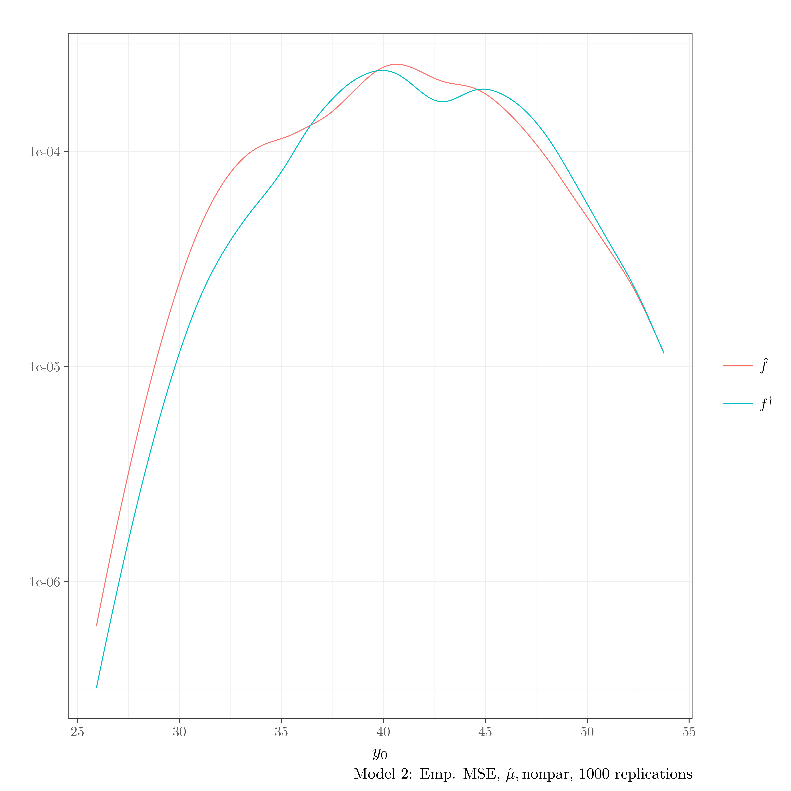
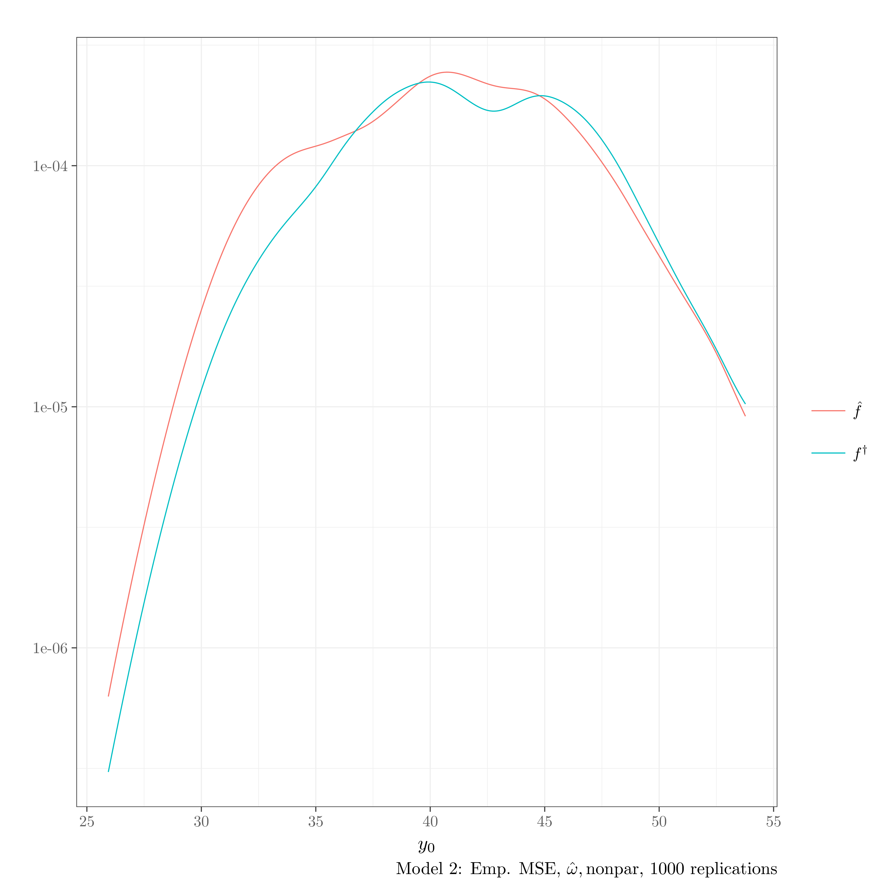
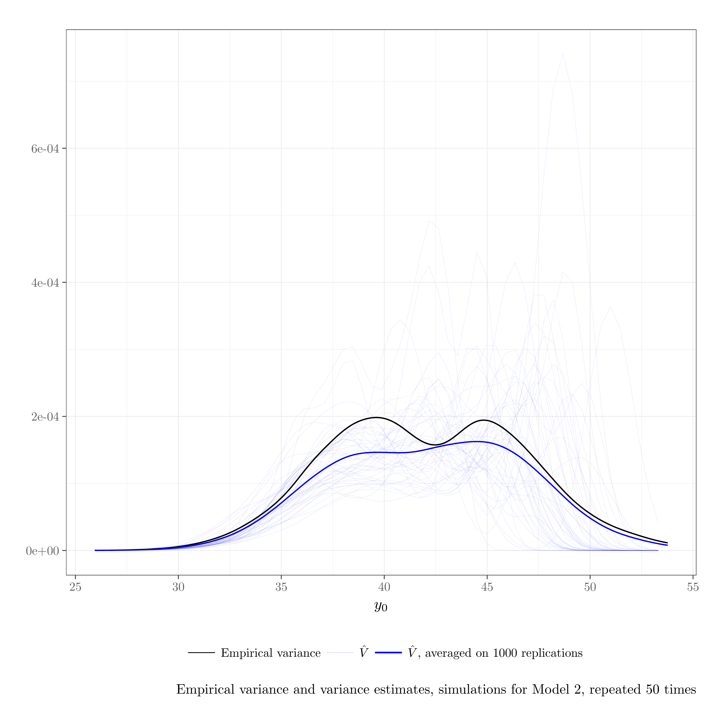
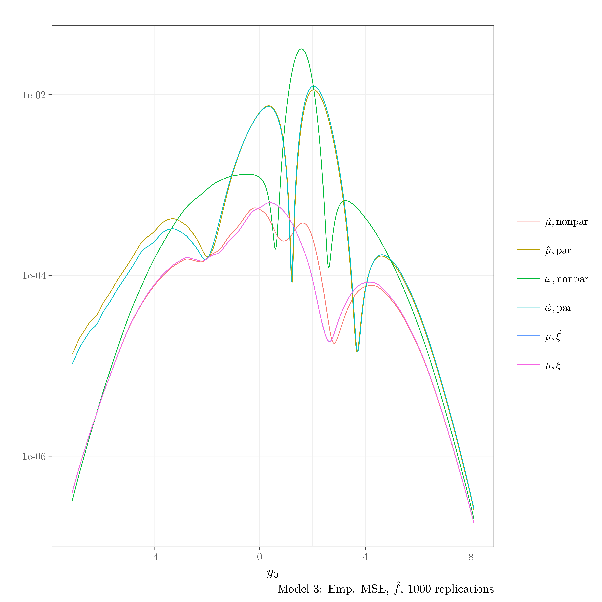

# Kernel Estimation for a Superpopulation Probability Density Function under Informative Selection
`pubBonneryBreidtCoquet2017` is an R package that contains the source code to reproduce the graphs and simulations of the article
"Kernel Estimation for a Superpopulation Probability Density Function under Informative Selection", by 
Daniel Bonnéry (UMD),  F. Jay Breidt (CSU) and  François Coquet (Irmar and Ensai), article under revision in Metron Journal.

## 1. How to install the package

```r
devtools::install_github("DanielBonnery/pubBonneryBreidtCoquet2017",dependencies=TRUE)
```

Note that this package depends on different R packages, including:
* [pubBonneryBreidtCoquet2016](https://github.com/DanielBonnery/pubBonneryBreidtCoquet2016) is an R package that contains generic functions to simulate populations and draw samples.
* [yihui/tikzDevice](https://github.com/yihui/tikzDevice) is an R package that allows to create tikz code from a graph.

Some functions of `pubBonneryBreidtCoquet2017` produce pdf graphics and need pdflatex to be installed.

## 2. Run the simulations

## 2.1. Obtain the paper graphs and tables.


```r
library(pubBonneryBreidtCoquet2017)
demo(MSE_Figure)
```


|Estimator                                    |IMSE           |IMSE $\mid Y<q_{.25}$ |IMSE $\mid q_{.25}<Y<q_{.5}$ |IMSE $\mid q_{.5}<Y<q_{.75}$ |IMSE $\mid q_{.75}<Y$ |
|:--------------------------------------------|:--------------|:---------------------|:----------------------------|:----------------------------|:---------------------|
|$f$                                          |0 (0)          |0 (0)                 |0 (0)                        |0 (0)                        |0 (0)                 |
|(15) $\hat{f}_{\hat\mu,\rm{par}}$            |0.0017 (1.6)   |0.00023 (1.9)         |4e-04 (1.9)                  |0.00014 (0.59)               |0.00098 (1.9)         |
|(12) $\hat{f}_{\hat\mu,\rm{nonpar}}$         |0.0011 (1)     |0.00012 (1)           |2e-04 (1)                    |0.00023 (1)                  |0.00052 (1)           |
|(13) $\hat{f}_{\mu,\xi}$                     |0.0016 (1.5)   |0.00015 (1.2)         |0.00027 (1.3)                |9.1e-05 (0.39)               |0.0011 (2.1)          |
|(14) $\hat{f}_{\mu,\hat\xi}$                 |0.0018 (1.7)   |0.00019 (1.6)         |0.00029 (1.4)                |9.7e-05 (0.42)               |0.0012 (2.3)          |
|(4) $p$                                      |0.015 (14)     |0.0072 (59)           |0.00052 (2.6)                |0.0033 (14)                  |0.0037 (7.1)          |
|(23) $f^\dagger_{\hat\mu,\rm{par}}$          |0.001 (0.94)   |0.00013 (1)           |0.00019 (0.91)               |0.00022 (0.95)               |0.00048 (0.93)        |
|(20) $f^\dagger_{\hat\mu,\rm{nonpar}}$       |0.0015 (1.4)   |0.00043 (3.5)         |0.00015 (0.73)               |0.00041 (1.8)                |0.00051 (0.99)        |
|(21) $f^\dagger_{\mu,\xi}$                   |0.00094 (0.87) |9.8e-05 (0.81)        |0.00018 (0.86)               |0.00021 (0.9)                |0.00045 (0.87)        |
|(22) $f^\dagger_{\mu,\hat\xi}$               |0.001 (0.96)   |0.00012 (0.99)        |0.00019 (0.94)               |0.00021 (0.91)               |0.00051 (0.98)        |
|(25) $f^\dagger_{\hat\omega,\rm{nonpar}}$    |0.0015 (1.4)   |0.00046 (3.8)         |0.00014 (0.69)               |4e-04 (1.7)                  |5e-04 (0.97)          |
|(26) $f^\dagger_{\hat\omega,\rm{par}}$       |0.001 (0.93)   |0.00012 (1)           |0.00018 (0.89)               |0.00022 (0.94)               |0.00048 (0.92)        |
|(wnonpar) $\hat{f}_{\hat\omega,\rm{nonpar}}$ |0.001 (0.96)   |0.00014 (1.2)         |0.00019 (0.94)               |0.00022 (0.97)               |0.00048 (0.92)        |
|(wpar) $\hat{f}_{\hat\omega,\rm{par}}$       |0.0017 (1.6)   |0.00023 (1.9)         |0.00039 (1.9)                |0.00013 (0.57)               |0.00097 (1.9)         |
|$\hat\mu,\rm{par}                            |0.00016 (0.15) |0.00016 (1.3)         |7.7e-07 (0.0038)             |3.3e-07 (0.0014)             |3.2e-07 (0.00061)     |
|$\hat\mu,\rm{nonpar}                         |0.00041 (0.38) |0.00039 (3.2)         |2.7e-06 (0.013)              |2.8e-06 (0.012)              |1e-05 (0.02)          |
|$\mu,\hat\xi                                 |0.00089 (0.83) |0.00086 (7)           |2.1e-05 (0.1)                |9.2e-06 (0.04)               |7.1e-06 (0.014)       |
|$\mu,\xi                                     |0 (0)          |0 (0)                 |0 (0)                        |0 (0)                        |0 (0)                 |
|$\hat\omega,\rm{nonpar}                      |0.0014 (1.3)   |0.0014 (12)           |4.5e-06 (0.022)              |8.1e-07 (0.0035)             |5.4e-06 (0.01)        |
|$\hat\omega,\rm{par}                         |0.00015 (0.14) |0.00015 (1.2)         |8e-07 (0.0039)               |3.3e-07 (0.0014)             |3.1e-07 (6e-04)       |

## 2.2. Additional simulations

## 2.2.1 Models 
We ran simulations on different models. For each model, we produce a series of graphics and tables.


## 2.2.2 How to run
The following R statements  will run the simulations for all the models.


```r
library(pubBonneryBreidtCoquet2017)
demo(model1,package = "pubBonneryBreidtCoquet2017")
demo(model2,package = "pubBonneryBreidtCoquet2017")
demo(model3,package = "pubBonneryBreidtCoquet2017")
demo(model4,package = "pubBonneryBreidtCoquet2017")
demo(model5,package = "pubBonneryBreidtCoquet2017")
```


## 2.2.3 Ouptputs: Graphs













## 2.2.4 Ouptputs: Tables


